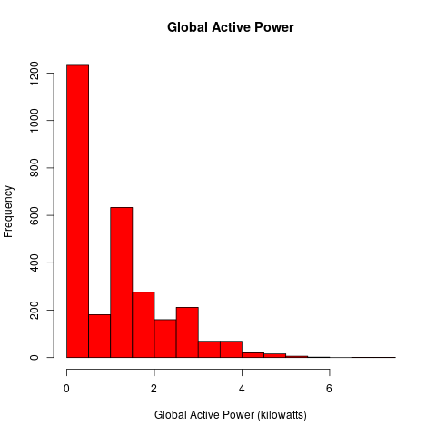
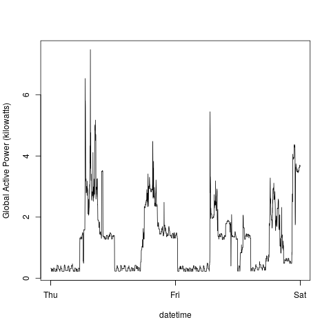
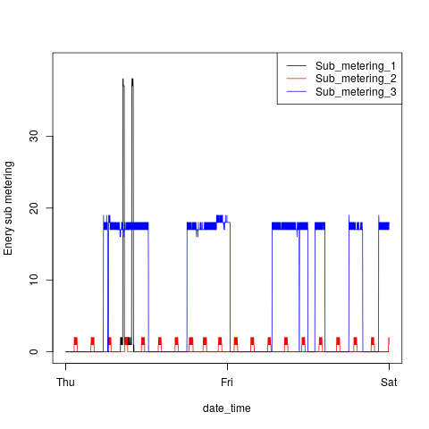
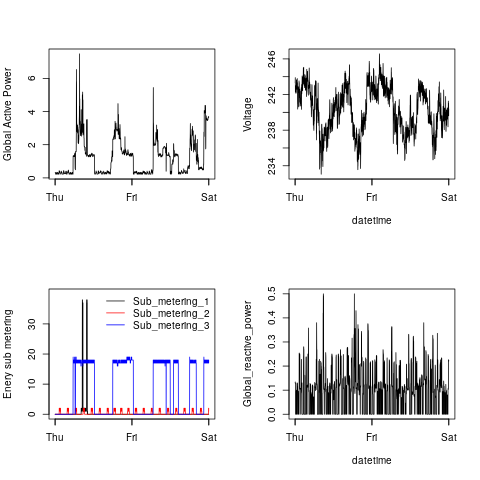

# Instructions

## Dependencies

lubridate and dplyr are required.

## Behaviour

All the loading and cleansing code are in `load_data.R`. It prefer the existing clean data to load. If clean data does not exist, it will try to refine it from `household_power_consumption.txt`, and if `household_power_consumption.txt` is not exist either it will try to download and unzip to get the data file.

## Execute

To generate the plots, please run the following commands:

```
Rscript plot1.R
Rscript plot2.R
Rscript plot3.R
Rscript plot4.R
```

## Generated plots

### Plot 1


 


### Plot 2

 


### Plot 3

 


### Plot 4

 
